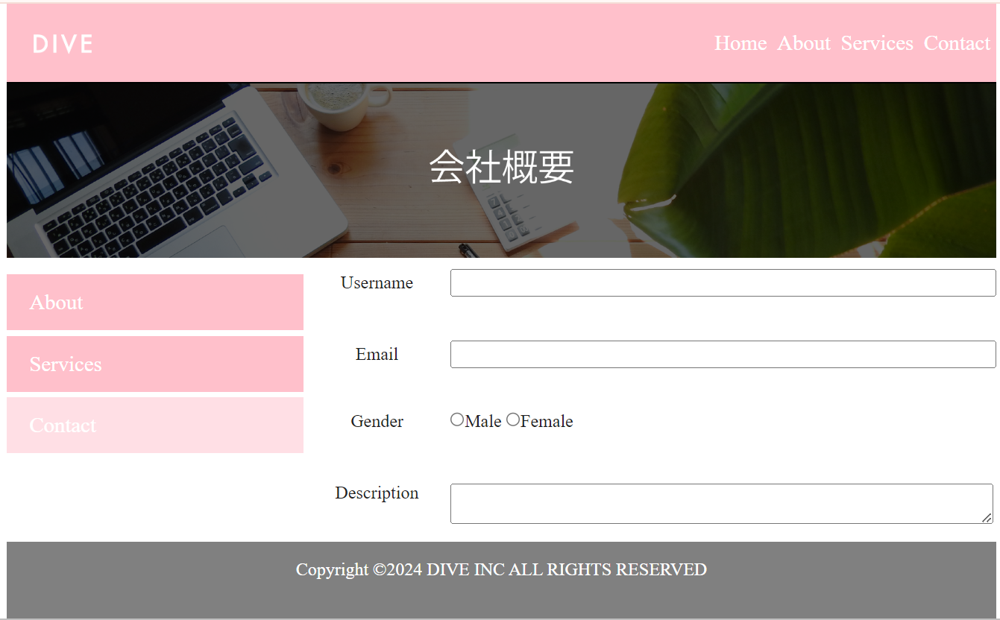

# Assignment Details

## Overall Layout:

- The page should have a navigation bar at the top with the links "Home," "About," "Services," and "Contact," all aligned to the right. The "DIVE" logo should be on the left side of the navbar.
- Below the navigation, there should be a background image (like the one shown) with text overlay in the center.
- On the left side, create a vertical navigation bar with "About," "Services," and "Contact" buttons.

## Content Area:

- Create a form on the right side of the page that includes fields for "Username," "Email," "Gender" (with radio buttons), and a "Description" text area.

## Styling Details:

- Use a pink color (`#F7B7C3`) for the top navigation and left-side buttons.
- When hovering over the right-side buttons or links, the background should change to a mediumaquamarine color (`#66CDAA`).
- The "Submit" button in the form should have a background color of mediumaquamarine (`#66CDAA`).
- Ensure the footer is styled with a grey background and contains the text “Copyright ©2016 DIVE INC ALL RIGHTS RESERVED”.

## Additional Instructions:

- Make sure the page layout is responsive.
- Include the "DIVE" favicon.
- Pay close attention to the alignment, spacing, and font styles to make the webpage visually similar to the attached image.
- When work done push your work to the github then share me your github link

Please refer to the image attached for a visual reference to understand how the webpage should look. then where image is important download it below

### Dive logo image

### contact image

